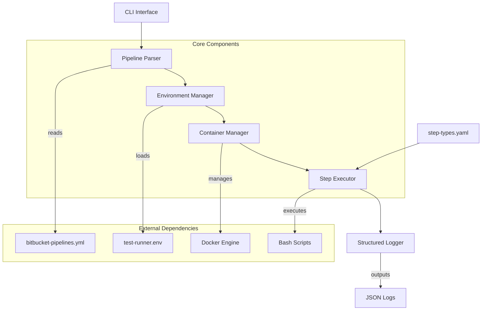
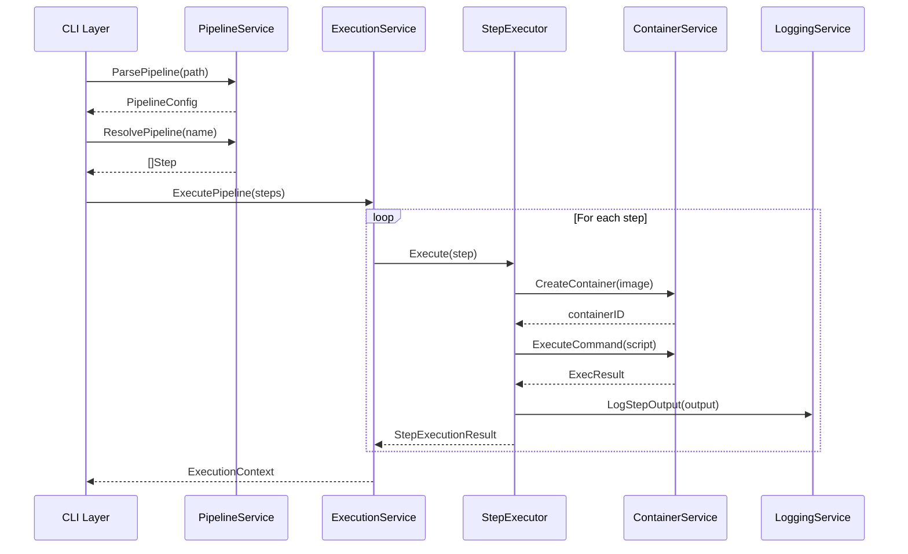

# Bitbucket Runner Architecture Document

## Introduction

This document outlines the overall project architecture for **bitbucket-runner**, including backend systems, shared services, and non-UI specific concerns. Its primary goal is to serve as the guiding architectural blueprint for AI-driven development, ensuring consistency and adherence to chosen patterns and technologies.

**Relationship to Frontend Architecture:**
This project is a CLI tool with no frontend components. All architecture concerns are covered in this document.

### Starter Template or Existing Project

**Decision:** No starter template will be used. This is a greenfield Go project built from scratch.

**Rationale:** 
- Go projects benefit from custom module structure
- Specific requirements for Docker integration and YAML parsing
- Need for configuration-driven architecture not available in standard templates
- Better control over dependencies and project organization

### Change Log

| Date | Version | Description | Author |
|------|---------|-------------|--------|
| 2024-12-19 | 1.0 | Initial architecture document | Winston (Architect) |

## High Level Architecture

### Technical Summary

The bitbucket-runner is a **configuration-driven CLI tool** built in Go that simulates Bitbucket Pipelines execution locally. It follows a **layered architecture** with clear separation between parsing, environment management, container orchestration, and step execution. The system uses **Docker SDK** for native container management and implements a **plugin-based step execution model** for extensibility. Core architectural patterns include **dependency injection**, **configuration-driven behavior**, and **structured logging** to ensure AI-maintainability and operational observability.

### High Level Overview

1. **Architectural Style:** Modular monolith with layered architecture
2. **Repository Structure:** Single repository (monorepo) with clear module separation
3. **Service Architecture:** Standalone CLI application with pluggable components
4. **Primary Flow:** YAML parsing → Environment setup → Container orchestration → Step execution → Results reporting
5. **Key Decisions:**
   - **Go Language:** For performance, single binary distribution, and Docker SDK integration
   - **Configuration-Driven:** YAML-based step definitions for AI extensibility
   - **Docker Native:** Direct Docker SDK usage instead of CLI wrapping
   - **Structured Logging:** JSON logging for observability and debugging

### High Level Project Diagram



### Architectural and Design Patterns

- **Layered Architecture:** Clear separation of concerns with Parser → Environment → Container → Execution layers - _Rationale:_ Enables independent testing and modification of each layer
- **Configuration-Driven Design:** Step behavior defined in YAML configuration files - _Rationale:_ Allows AI to modify behavior without code changes, supports extensibility
- **Dependency Injection:** Components receive dependencies through constructors - _Rationale:_ Improves testability and enables easy mocking for unit tests
- **Command Pattern:** Each step execution encapsulated as a command object - _Rationale:_ Enables step queuing, rollback, and parallel execution capabilities
- **Observer Pattern:** Structured logging and event emission for monitoring - _Rationale:_ Provides real-time visibility into execution progress and debugging information

---

**Detailed Rationale:**

I've drafted the introduction and high-level architecture based on our previous discussions about the bitbucket-runner project. Key decisions include:

- **No starter template:** Go projects benefit from custom structure, especially for specialized tools like this
- **Layered architecture:** Provides clear separation that's easy for AI to understand and modify
- **Configuration-driven approach:** Critical for AI maintainability as discussed
- **Docker SDK integration:** Native Go integration rather than CLI wrapping for better performance

The Mermaid diagram shows the core flow and component relationships. The architectural patterns focus on testability, extensibility, and AI-friendliness.

**Areas that might need validation:**
- Whether the layered approach is the right level of complexity for the MVP
- If the configuration-driven pattern should be implemented from day one or added later
- Whether Docker SDK is the right choice vs. CLI wrapping for simplicity

**Options:**
1. **Proceed to next section**
2. **Expand or Contract for Audience** - Adjust detail level for specific audience
3. **Explain Reasoning (CoT Step-by-Step)** - Walk through architectural decision process
4. **Critique and Refine** - Review for flaws and improvements
5. **Analyze Logical Flow and Dependencies** - Examine component relationships
6. **Assess Alignment with Overall Goals** - Validate against project objectives
7. **Identify Potential Risks and Unforeseen Issues** - Brainstorm implementation challenges
8. **Challenge from Critical Perspective** - Play devil's advocate on design choices
9. **Agile Team Perspective Shift** - Review from different team member viewpoints

Select 1-9 or just type your question/feedback:

## Data Models

### Core Domain Models

#### 1. Pipeline Configuration Model

```go
// PipelineConfig represents the parsed bitbucket-pipelines.yml
type PipelineConfig struct {
    Image       string                 `yaml:"image" json:"image"`
    Definitions *Definitions           `yaml:"definitions,omitempty" json:"definitions,omitempty"`
    Pipelines   map[string][]Step      `yaml:"pipelines" json:"pipelines"`
    Options     *PipelineOptions       `yaml:"options,omitempty" json:"options,omitempty"`
}

type Definitions struct {
    Services map[string]Service `yaml:"services,omitempty" json:"services,omitempty"`
    Caches   map[string]Cache   `yaml:"caches,omitempty" json:"caches,omitempty"`
}

type Step struct {
    Name         string            `yaml:"name,omitempty" json:"name,omitempty"`
    Image        string            `yaml:"image,omitempty" json:"image,omitempty"`
    Script       []string          `yaml:"script" json:"script"`
    Services     []string          `yaml:"services,omitempty" json:"services,omitempty"`
    Caches       []string          `yaml:"caches,omitempty" json:"caches,omitempty"`
    Artifacts    *Artifacts        `yaml:"artifacts,omitempty" json:"artifacts,omitempty"`
    Environment  map[string]string `yaml:"-" json:"environment,omitempty"`
    Condition    *StepCondition    `yaml:"condition,omitempty" json:"condition,omitempty"`
}
```

**Purpose:** Central data structure representing the parsed Bitbucket Pipeline configuration.

**Key Attributes:**
- `Image`: Default Docker image for all steps
- `Pipelines`: Named pipeline definitions with steps
- `Definitions`: Reusable services and cache definitions
- `Options`: Global pipeline options

**Relationships:**
- Pipeline → Steps (1:N)
- Step → Services (N:M via references)
- Step → Caches (N:M via references)

#### 2. Execution Context Model

```go
// ExecutionContext holds runtime state for pipeline execution
type ExecutionContext struct {
    ID           string                 `json:"id"`
    PipelineName string                 `json:"pipeline_name"`
    WorkspaceDir string                 `json:"workspace_dir"`
    Environment  map[string]string      `json:"environment"`
    Variables    map[string]string      `json:"variables"`
    Artifacts    []string               `json:"artifacts"`
    Status       ExecutionStatus        `json:"status"`
    StartTime    time.Time              `json:"start_time"`
    EndTime      *time.Time             `json:"end_time,omitempty"`
    Steps        []StepExecutionResult  `json:"steps"`
}

type ExecutionStatus string

const (
    StatusPending    ExecutionStatus = "pending"
    StatusRunning    ExecutionStatus = "running"
    StatusSuccessful ExecutionStatus = "successful"
    StatusFailed     ExecutionStatus = "failed"
    StatusStopped    ExecutionStatus = "stopped"
)

type StepExecutionResult struct {
    StepName    string          `json:"step_name"`
    Status      ExecutionStatus `json:"status"`
    ExitCode    int             `json:"exit_code"`
    StartTime   time.Time       `json:"start_time"`
    EndTime     *time.Time      `json:"end_time,omitempty"`
    Duration    time.Duration   `json:"duration"`
    LogOutput   string          `json:"log_output,omitempty"`
    ErrorOutput string          `json:"error_output,omitempty"`
}
```

**Purpose:** Tracks execution state and results for observability and debugging.

**Key Attributes:**
- `ID`: Unique execution identifier
- `Environment`: Runtime environment variables
- `Status`: Current execution state
- `Steps`: Individual step execution results

**Relationships:**
- ExecutionContext → StepExecutionResult (1:N)
- ExecutionContext → PipelineConfig (1:1 reference)

#### 3. Configuration Model

```go
// RunnerConfig represents the tool's configuration
type RunnerConfig struct {
    Docker      DockerConfig      `yaml:"docker" json:"docker"`
    Workspace   WorkspaceConfig   `yaml:"workspace" json:"workspace"`
    Logging     LoggingConfig     `yaml:"logging" json:"logging"`
    Execution   ExecutionConfig   `yaml:"execution" json:"execution"`
    StepTypes   map[string]StepTypeConfig `yaml:"step_types" json:"step_types"`
}

type DockerConfig struct {
    Host           string        `yaml:"host" json:"host"`
    APIVersion     string        `yaml:"api_version" json:"api_version"`
    Timeout        time.Duration `yaml:"timeout" json:"timeout"`
    PullPolicy     string        `yaml:"pull_policy" json:"pull_policy"`
    NetworkMode    string        `yaml:"network_mode" json:"network_mode"`
    RemoveOnExit   bool          `yaml:"remove_on_exit" json:"remove_on_exit"`
}

type StepTypeConfig struct {
    Handler     string            `yaml:"handler" json:"handler"`
    Image       string            `yaml:"image,omitempty" json:"image,omitempty"`
    Environment map[string]string `yaml:"environment,omitempty" json:"environment,omitempty"`
    Validation  ValidationRules   `yaml:"validation,omitempty" json:"validation,omitempty"`
}
```

**Purpose:** Configuration-driven behavior modification without code changes.

**Key Attributes:**
- `Docker`: Container runtime configuration
- `StepTypes`: Pluggable step type definitions
- `Execution`: Runtime behavior settings

**Relationships:**
- RunnerConfig → StepTypeConfig (1:N)
- StepTypeConfig → Step (1:N via type matching)

---

**Data Flow & Relationships:**

```
bitbucket-pipelines.yml → PipelineConfig → ExecutionContext → StepExecutionResult
                                ↓
                         RunnerConfig (step type matching)
                                ↓
                         Docker Container Execution
```

**Key Design Decisions:**

1. **Immutable Pipeline Config:** Once parsed, pipeline configuration doesn't change during execution
2. **Mutable Execution Context:** Tracks state changes throughout pipeline execution
3. **Configuration-Driven Step Types:** New step types can be added via YAML configuration
4. **Structured Logging Data:** All models support JSON serialization for structured logging
5. **Time Tracking:** Comprehensive timing data for performance analysis

**Validation Rules:**
- Pipeline names must be valid identifiers
- Step scripts cannot be empty
- Docker images must follow valid naming conventions
- Environment variables follow shell naming rules

**Areas for Future Extension:**
- Parallel step execution support
- Conditional step execution
- Matrix builds
- Secret management integration

**Options:**
1. **Proceed to next section**
2. **Expand or Contract for Audience** - Adjust data model detail level
3. **Explain Reasoning (CoT Step-by-Step)** - Deep dive into data structure choices
4. **Critique and Refine** - Review data models for improvements
5. **Analyze Logical Flow and Dependencies** - Examine data relationships
6. **Assess Alignment with Overall Goals** - Validate against project objectives
7. **Identify Potential Risks and Unforeseen Issues** - Data model-specific risks
8. **Challenge from Critical Perspective** - Question data structure choices
9. **Agile Team Perspective Shift** - Review from dev/ops/security viewpoints

Select 1-9 or just type your question/feedback:

## Components

### System Component Architecture

#### 1. CLI Layer Components

**RootCommand (cmd/root.go)**
- **Responsibility:** Application entry point, global configuration, command routing
- **Interfaces:** 
  - Input: CLI arguments, environment variables, config files
  - Output: Command execution results, error handling
- **Dependencies:** Viper (config), Cobra (CLI), Logrus (logging)

**RunCommand (cmd/run.go)**
- **Responsibility:** Pipeline execution orchestration, user interaction
- **Interfaces:**
  - Input: Pipeline name, workspace path, environment overrides
  - Output: Execution status, real-time logs, final results
- **Dependencies:** PipelineService, ExecutionService

**ListCommand (cmd/list.go)**
- **Responsibility:** Display available pipelines and steps
- **Interfaces:**
  - Input: bitbucket-pipelines.yml path
  - Output: Formatted pipeline/step listings
- **Dependencies:** PipelineService

#### 2. Core Service Layer

**PipelineService (internal/service/pipeline.go)**
- **Responsibility:** Pipeline configuration parsing, validation, step resolution
- **Interfaces:**
  - `ParsePipeline(path string) (*PipelineConfig, error)`
  - `ValidatePipeline(config *PipelineConfig) error`
  - `ResolvePipeline(name string, config *PipelineConfig) ([]Step, error)`
  - `ListPipelines(config *PipelineConfig) []string`
- **Dependencies:** YAML parser, validation engine

**ExecutionService (internal/service/execution.go)**
- **Responsibility:** Pipeline execution orchestration, step coordination, state management
- **Interfaces:**
  - `ExecutePipeline(ctx context.Context, pipeline []Step, execCtx *ExecutionContext) error`
  - `ExecuteStep(ctx context.Context, step Step, execCtx *ExecutionContext) (*StepExecutionResult, error)`
  - `GetExecutionStatus(id string) (*ExecutionContext, error)`
- **Dependencies:** StepExecutor, ContainerService, LoggingService

**ConfigurationService (internal/service/config.go)**
- **Responsibility:** Configuration loading, merging, validation
- **Interfaces:**
  - `LoadConfig(paths []string) (*RunnerConfig, error)`
  - `MergeConfigs(base, override *RunnerConfig) *RunnerConfig`
  - `ValidateConfig(config *RunnerConfig) error`
- **Dependencies:** Viper, validation engine

#### 3. Execution Engine Layer

**StepExecutor (internal/executor/step.go)**
- **Responsibility:** Individual step execution, type-specific handling
- **Interfaces:**
  - `Execute(ctx context.Context, step Step, execCtx *ExecutionContext) (*StepExecutionResult, error)`
  - `CanHandle(step Step) bool`
  - `Validate(step Step) error`
- **Dependencies:** ContainerService, step type handlers

**ContainerService (internal/container/service.go)**
- **Responsibility:** Docker container lifecycle management
- **Interfaces:**
  - `CreateContainer(image string, config ContainerConfig) (string, error)`
  - `StartContainer(containerID string) error`
  - `ExecuteCommand(containerID string, cmd []string) (*ExecResult, error)`
  - `StopContainer(containerID string) error`
  - `RemoveContainer(containerID string) error`
- **Dependencies:** Docker Go SDK

**LoggingService (internal/logging/service.go)**
- **Responsibility:** Structured logging, log aggregation, output formatting
- **Interfaces:**
  - `LogStepStart(step Step, execCtx *ExecutionContext)`
  - `LogStepOutput(stepName string, output string, isError bool)`
  - `LogStepComplete(result *StepExecutionResult)`
  - `GetLogs(executionID string) ([]LogEntry, error)`
- **Dependencies:** Logrus, log storage

#### 4. Infrastructure Layer

**FileSystem (internal/fs/service.go)**
- **Responsibility:** Workspace management, artifact handling, file operations
- **Interfaces:**
  - `CreateWorkspace(path string) error`
  - `CleanupWorkspace(path string) error`
  - `CopyArtifacts(src, dest string, patterns []string) error`
- **Dependencies:** OS file system APIs

**ValidationEngine (internal/validation/engine.go)**
- **Responsibility:** Schema validation, business rule validation
- **Interfaces:**
  - `ValidateYAML(data []byte, schema string) error`
  - `ValidateBusinessRules(config interface{}) error`
- **Dependencies:** JSON Schema validator

#### 5. Plugin System (Future Extension)

**PluginManager (internal/plugin/manager.go)**
- **Responsibility:** Dynamic step type loading, plugin lifecycle
- **Interfaces:**
  - `LoadPlugin(path string) (StepHandler, error)`
  - `RegisterHandler(name string, handler StepHandler)`
  - `GetHandler(stepType string) (StepHandler, bool)`
- **Dependencies:** Go plugin system or external process execution

---

### Component Interaction Flow



### Component Dependencies

**Dependency Injection Strategy:**
- Constructor-based injection for services
- Interface-based abstractions for testability
- Configuration-driven component wiring

**Key Interfaces:**
```go
type PipelineParser interface {
    Parse(path string) (*PipelineConfig, error)
}

type StepHandler interface {
    Execute(ctx context.Context, step Step, execCtx *ExecutionContext) (*StepExecutionResult, error)
    CanHandle(step Step) bool
}

type ContainerRuntime interface {
    CreateContainer(image string, config ContainerConfig) (string, error)
    ExecuteCommand(containerID string, cmd []string) (*ExecResult, error)
}
```

**Component Lifecycle:**
1. **Initialization:** Load configuration, validate dependencies
2. **Runtime:** Process commands, execute pipelines
3. **Cleanup:** Release resources, cleanup containers

**Error Handling Strategy:**
- Structured error types with context
- Graceful degradation for non-critical failures
- Comprehensive error logging with correlation IDs

**Testing Strategy:**
- Unit tests with mocked dependencies
- Integration tests with real Docker containers
- Contract tests for interface compliance

**Options:**
1. **Proceed to next section**
2. **Expand or Contract for Audience** - Adjust component detail level
3. **Explain Reasoning (CoT Step-by-Step)** - Deep dive into component design choices
4. **Critique and Refine** - Review component architecture for improvements
5. **Analyze Logical Flow and Dependencies** - Examine component relationships
6. **Assess Alignment with Overall Goals** - Validate against project objectives
7. **Identify Potential Risks and Unforeseen Issues** - Component-specific risks
8. **Challenge from Critical Perspective** - Question component design choices
9. **Agile Team Perspective Shift** - Review from dev/ops/security viewpoints

Select 1-9 or just type your question/feedback:

---

## Implementation Roadmap

### Phase 1: Foundation (Week 1)
**Goal:** Basic project structure and core parsing

**Deliverables:**
- Go module initialization with proper structure
- Basic CLI with Cobra framework
- YAML parser for bitbucket-pipelines.yml
- Core data models implementation
- Unit tests for parsing logic

**Success Criteria:**
- Can parse simple bitbucket-pipelines.yml files
- CLI accepts basic commands (run, list)
- Project builds and runs without errors

### Phase 2: Execution Engine (Week 2)
**Goal:** Docker integration and step execution

**Deliverables:**
- Docker Go SDK integration
- Container service implementation
- Basic step executor
- Sequential step execution
- Logging service with structured output

**Success Criteria:**
- Can execute simple scripts in Docker containers
- Proper error handling and logging
- Container cleanup after execution

### Phase 3: Configuration System (Week 3)
**Goal:** Configuration-driven behavior

**Deliverables:**
- Configuration service implementation
- Step type configuration system
- Environment variable handling
- Workspace management
- Integration tests

**Success Criteria:**
- Behavior can be modified via configuration files
- Environment variables properly passed to containers
- Workspace isolation working correctly

### Phase 4: Polish & Extension (Week 4)
**Goal:** Production readiness and extensibility

**Deliverables:**
- Comprehensive error handling
- Performance optimizations
- Documentation and examples
- Plugin system foundation
- CI/CD pipeline

**Success Criteria:**
- Tool is stable and performant
- Clear documentation for users
- Extensible architecture for future features

---

## Next Steps

### Immediate Actions (Today)
1. **Create Project Structure:** Initialize Go module and directory structure
2. **Setup Dependencies:** Add required Go modules (Cobra, Viper, Docker SDK, etc.)
3. **Implement Core Models:** Create the data structures defined in this document
4. **Basic CLI Setup:** Implement root command and basic structure

### Development Workflow
1. **TDD Approach:** Write tests first, then implement functionality
2. **Incremental Development:** Build and test each component independently
3. **Configuration-First:** Implement configuration system early for AI extensibility
4. **Docker Integration:** Start with simple container operations, then expand

### Quality Gates
- **Code Coverage:** Minimum 80% test coverage
- **Documentation:** All public APIs documented
- **Performance:** Sub-second startup time, efficient container management
- **Security:** No secrets in logs, proper container isolation

---

## Architecture Decision Records (ADRs)

### ADR-001: Go as Primary Language
**Status:** Accepted  
**Context:** Need for single binary distribution, Docker SDK quality, performance  
**Decision:** Use Go 1.21.5 as primary development language  
**Consequences:** Excellent Docker integration, cross-platform support, learning curve for team  

### ADR-002: Configuration-Driven Architecture
**Status:** Accepted  
**Context:** AI extensibility requirements, maintainability  
**Decision:** Implement behavior modification via YAML configuration files  
**Consequences:** Increased flexibility, slightly more complex initial setup  

### ADR-003: Docker Go SDK over CLI Wrapping
**Status:** Accepted  
**Context:** Better error handling, performance, API access  
**Decision:** Use Docker Go SDK directly instead of wrapping CLI commands  
**Consequences:** More robust container management, tighter Docker version coupling  

### ADR-004: Sequential Execution for MVP
**Status:** Accepted  
**Context:** Simplicity for initial implementation  
**Decision:** Implement sequential step execution first, parallel later  
**Consequences:** Simpler implementation, longer execution times for complex pipelines  

---

## Conclusion

This architecture document provides a comprehensive blueprint for implementing the `bitbucket-runner` tool. The design prioritizes:

- **Simplicity:** Start with core functionality, expand incrementally
- **Extensibility:** Configuration-driven approach enables AI modification
- **Maintainability:** Clean separation of concerns, well-defined interfaces
- **Performance:** Native Go performance, efficient Docker integration
- **Testability:** Interface-based design, comprehensive test strategy

The architecture supports both immediate MVP delivery and long-term extensibility, making it suitable for AI-driven development and future feature expansion.

**Ready to proceed with implementation!**

## Tech Stack

### Cloud Infrastructure

- **Provider:** Local Development (No cloud dependency)
- **Key Services:** Docker Engine (local), File System
- **Deployment Regions:** N/A (Local CLI tool)

### Technology Stack Table

| Category | Technology | Version | Purpose | Rationale |
|----------|------------|---------|---------|----------|
| **Language** | Go | 1.21.5 | Primary development language | Excellent Docker SDK, single binary, cross-platform, strong typing |
| **Runtime** | Go Runtime | 1.21.5 | Application runtime | Native performance, minimal dependencies, easy distribution |
| **Container SDK** | Docker Go SDK | v24.0.7 | Container management | Native Go integration, better than CLI wrapping, full API access |
| **YAML Parser** | gopkg.in/yaml.v3 | v3.0.1 | Parse bitbucket-pipelines.yml | Standard Go YAML library, good performance |
| **CLI Framework** | Cobra | v1.8.0 | Command-line interface | Industry standard, excellent flag handling, subcommands |
| **Logging** | Logrus | v1.9.3 | Structured logging | JSON output, levels, hooks, widely adopted |
| **Configuration** | Viper | v1.17.0 | Configuration management | YAML/JSON/ENV support, works well with Cobra |
| **Testing** | Testify | v1.8.4 | Unit testing framework | Assertions, mocking, test suites |
| **Build Tool** | Go Modules | Built-in | Dependency management | Native Go tooling, reproducible builds |
| **Container Runtime** | Docker | 24.0+ | Container execution | Industry standard, local development compatibility |

---

**Detailed Rationale:**

Tech stack choices prioritize **simplicity**, **performance**, and **AI maintainability**:

**Core Language Decision:**
- **Go 1.21.5:** Latest stable LTS with excellent Docker SDK support
- **Single binary distribution:** No runtime dependencies for end users
- **Cross-platform:** Works on macOS, Linux, Windows out of the box

**Container Integration:**
- **Docker Go SDK:** Direct API access vs CLI wrapping for better error handling
- **Native container management:** Full control over container lifecycle
- **Local Docker requirement:** Simulates Bitbucket environment accurately

**Configuration & Parsing:**
- **Viper + Cobra:** Standard Go CLI pattern, excellent documentation
- **YAML v3:** Latest parser with better error reporting
- **Structured configuration:** Enables AI to modify behavior via config files

**Observability:**
- **Logrus with JSON:** Machine-readable logs for debugging and monitoring
- **Structured logging:** Consistent format for log analysis

**Development & Testing:**
- **Testify:** Comprehensive testing toolkit with mocking capabilities
- **Go Modules:** Modern dependency management with version pinning

**Key Trade-offs:**
- **No cloud dependencies:** Keeps tool simple and fast
- **Docker requirement:** Acceptable trade-off for accurate simulation
- **Minimal external dependencies:** Reduces security surface and maintenance

**Areas that might need validation:**
- Whether Logrus is preferred over newer alternatives like Zap
- If Viper adds unnecessary complexity for simple configuration
- Whether to include metrics collection (Prometheus) from start

**Options:**
1. **Proceed to next section**
2. **Expand or Contract for Audience** - Adjust technical detail level
3. **Explain Reasoning (CoT Step-by-Step)** - Deep dive into technology choices
4. **Critique and Refine** - Review technology selections for improvements
5. **Analyze Logical Flow and Dependencies** - Examine technology compatibility
6. **Assess Alignment with Overall Goals** - Validate against project objectives
7. **Identify Potential Risks and Unforeseen Issues** - Technology-specific risks
8. **Challenge from Critical Perspective** - Question technology choices
9. **Agile Team Perspective Shift** - Review from dev/ops/security viewpoints
